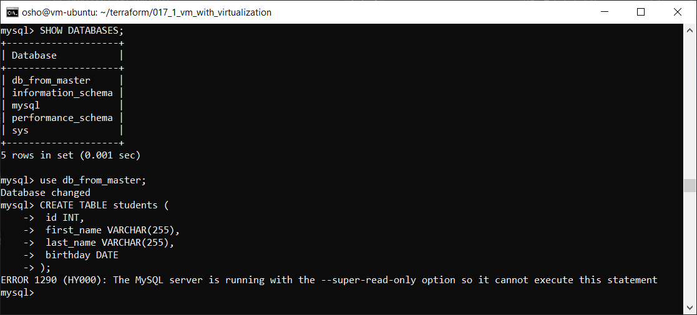
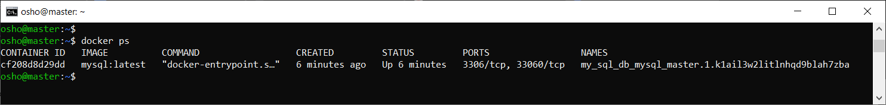
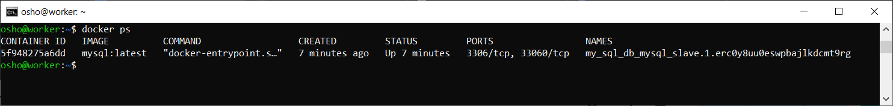
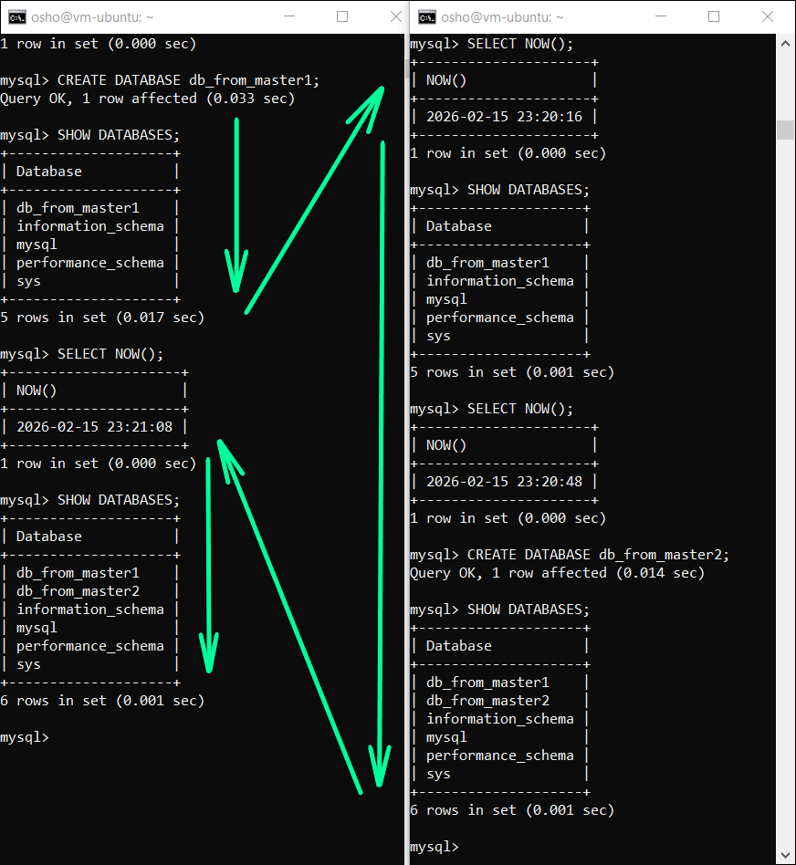

# Домашнее задание к занятию «Репликация и масштабирование. Часть 1»

### Задание 1

На лекции рассматривались режимы репликации master-slave, master-master, опишите их различия.

*Ответить в свободной форме.*

### Решение 1

В режиме **master-slave**, master-сервер может выполнять все действия с базами данных (чтение, редактирование, обновление, удаление), а slave-сервер только обработку запросов (чтение). Можно использовать для перераспределения нагрузки между серверами по ролям. Если master выйдет из строя, то обрабатывать запросы всё ещё будет возможно. Также обеспечивается целостность данных: при возникновении ошибки файловой системы на master-сервере, slave-сервер хранит копию и проверяет целостность приходящих WAL-логов, что служит дополнительным фильтром ошибок.
Сомнительный момент: можно настроить slave-сервер так, чтобы он повторял действия master-сервера с задержкой - это может быть своеобразной "резервной копией".

В режиме **master-master** все серверы равноправны - это повышает отказоустойчивость, если один master-сервер откажет, то другой может его полностью заменить.

---

### Задание 2

Выполните конфигурацию master-slave репликации, примером можно пользоваться из лекции.

*Приложите скриншоты конфигурации, выполнения работы: состояния и режимы работы серверов.*


### Решение 2

#### Docker

Для решения используется образ Docker на одном хосте.

...\
├── [docker-compose.yml](file/task1/docker/docker-compose.yml)\
├── [master.cnf](file/task1/master.cnf)\
└── [slave.cnf](file/task1/slave.cnf)

На мастере:

```sql
CREATE USER 'repl'@'%' IDENTIFIED BY '12345';
```

```sql
GRANT REPLICATION SLAVE ON *.* TO 'repl'@'%';
```

```sql
FLUSH PRIVILEGES;
```

```sql
SHOW BINARY LOG STATUS;
```

```
+------------------+----------+--------------+------------------+------------------------------------------+
| File             | Position | Binlog_Do_DB | Binlog_Ignore_DB | Executed_Gtid_Set                        |
+------------------+----------+--------------+------------------+------------------------------------------+
| mysql-bin.000003 |      897 |              |                  | 71b985ef-08fd-11f1-9f66-c2a29f918b7c:1-8 |
+------------------+----------+--------------+------------------+------------------------------------------+
```

На реплике:

```sql
CHANGE REPLICATION SOURCE TO
  SOURCE_HOST='mysql-master',
  SOURCE_USER='repl',
  SOURCE_PASSWORD='12345',
  SOURCE_LOG_FILE='mysql-bin.000003',
  SOURCE_LOG_POS=897;
```

```sql
START REPLICA;
```

Проверка на реплике:

```sql
SHOW REPLICA STATUS\G
```

- `Replica_IO_Running: Yes` — связь с мастером установлена. 
- `Replica_SQL_Running: Yes` — изменения успешно применяются. 
- `Seconds_Behind_Source: 0` — реплика идет в ногу с мастером, задержек нет.

Поверка:

Создание на мастере новой базы данных:

```sql
CREATE DATABASE test_db;
```


В этом всём этом есть проблема. На реплике всё ещё можно работать с таблицами, но изменения не будут отображаться на master. Также на реплике можно удалить БД, она на мастере останется, но на реплике её не будет т.к. реплика это не полное зеркало, а отображение последних команд. База данных не появится снова после внесения изменений на master`e, потому что команду на создание БД реплика уже не помнит. Чтобы этого не допустить нужно применить только чтение для всех пользователей. Также для удобства используется **GTID**.

#### Правильное решение

...\
├── [docker-compose.yml](file/task1_var2/docker-compose.yml)\
├── [master.cnf](file/task1_var2/master.cnf)\
└── [slave.cnf](file/task1_var2/slave.cnf)

На мастере:

```sql
CREATE USER 'repl'@'%' IDENTIFIED BY '12345';
GRANT REPLICATION SLAVE ON *.* TO 'repl'@'%';
FLUSH PRIVILEGES;
```

На реплике:

```sql
CHANGE REPLICATION SOURCE TO 
  SOURCE_HOST='mysql-master', 
  SOURCE_USER='repl', 
  SOURCE_PASSWORD='12345', 
  SOURCE_AUTO_POSITION = 1;
```

```sql
START REPLICA;
```

После чего установить права только на чтение в контейнере с репликой:
```
docker exec -it mysql-slave mysql -u root -p12345 -e "SET GLOBAL super_read_only = 1;"
```



#### Docker swarm

...\
├── [docker-compose.yml](file/docker_swarm/docker-compose.yml)\
├── [master.cnf](file/task1/master.cnf)\
└── [slave.cnf](file/task1/slave.cnf)

На мастере:

```
docker swarm init
```

На реплике(пример):

```
docker swarm join --token SWMTKN-1-5l7w4g1qswej94rj2j9yuq0ikxhd65hv8tck8ndipjaz6bagam-0l0177ssapqnxbyjvy40lax6s 10.0.1.28:2377
```

На мастере:

```
docker stack deploy -c docker-compose.yml my_sql_db
```



На реплике:



```sql
CHANGE REPLICATION SOURCE TO
  SOURCE_HOST='93.77.179.132',
  SOURCE_USER='repl',
  SOURCE_PASSWORD='slavepass',
  SOURCE_LOG_FILE='mysql-bin.000003',
  SOURCE_LOG_POS=897;
```

```sql
START REPLICA;
```

**Настройка SSL**

Поскольку связь проходит через внешний IP, данные передаются в открытом виде. Для безопасности их нужно шифровать.

На мастере:
```sql
ALTER USER 'repl'@'%' REQUIRE SSL;
```

```sql
FLUSH PRIVILEGES;
```

На реплике:
```sql
STOP REPLICA;
```

```sql
CHANGE REPLICATION SOURCE TO
  SOURCE_SSL = 1;
```

```sql
START REPLICA;
```

Проверка на мастере:

```sql
SELECT sbt.variable_value AS tls_version, t2.variable_value AS cipher, processlist_user AS user, processlist_host AS host 
FROM performance_schema.status_by_thread sbt
JOIN performance_schema.threads t1 ON sbt.thread_id = t1.thread_id
JOIN performance_schema.status_by_thread t2 ON t2.thread_id = t1.thread_id
WHERE sbt.variable_name = 'Ssl_version' 
AND t2.variable_name = 'Ssl_cipher' 
AND processlist_user = 'repl';
```

```
+-------------+------------------------+------+----------+
| tls_version | cipher                 | user | host     |
+-------------+------------------------+------+----------+
| TLSv1.3     | TLS_AES_128_GCM_SHA256 | repl | 10.0.0.2 |
+-------------+------------------------+------+----------+
1 row in set (0.025 sec)
```

Проверка режима "Read-Only"

```sql
SELECT @@GLOBAL.read_only;
```

На реплике будет 1, на мастере - 0.

---

### Задание 3

Выполните конфигурацию master-master репликации. Произведите проверку.

*Приложите скриншоты конфигурации, выполнения работы: состояния и режимы работы серверов.*


### Решение 3

Всё также в Docker`e

...\
├── [docker-compose.yml](file/task1/docker/docker-compose.yml)\
├── [master1.cnf](file/task3/master1.cnf)\
└── [master2.cnf](file/task3/master2.cnf)

#### Создание пользователя (на master1)

```sql
CREATE USER 'repl'@'%' IDENTIFIED BY '12345';
```

```sql
GRANT REPLICATION SLAVE ON *.* TO 'repl'@'%';
```

```sql
FLUSH PRIVILEGES;
```

#### Запуск репликаций

На **master2** (подключение к **master1**):

```sql
CHANGE REPLICATION SOURCE TO 
  SOURCE_HOST='mysql-master1', 
  SOURCE_USER='repl', 
  SOURCE_PASSWORD='12345', 
  SOURCE_AUTO_POSITION = 1;
```

```sql
START REPLICA;
```

На master1 (подключение к **master2**):

```sql
CHANGE REPLICATION SOURCE TO 
  SOURCE_HOST='mysql-master2', 
  SOURCE_USER='repl', 
  SOURCE_PASSWORD='12345', 
  SOURCE_AUTO_POSITION = 1;
```

```sql
START REPLICA;
```

#### Проверка статуса

На каждом сервере можно выполнить:

```sql
SHOW REPLICA STATUS\G
```

- Slave_IO_Running: Yes — связь установлена
- Slave_SQL_Running: Yes — транзакции успешно применяются
- Seconds_Behind_Master: 0 — задержек нет


#### Проверка

- Создана БД сначала на master1
  - Проверка на master2
- Создана БД на master2
  - Проверка на master1

